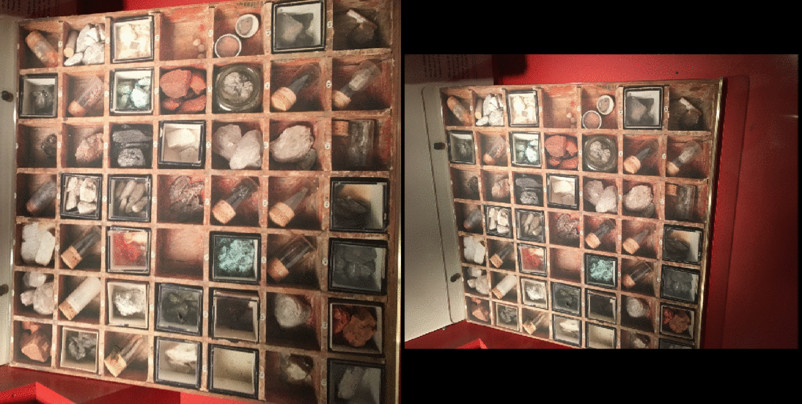

# DFM: A Performance Baseline for Deep Feature Matching

Python (Pytorch) and Matlab (MatConvNet) implementations of our paper DFM: A Performance Baseline for Deep Feature Matching at [CVPR 2021 Image Matching Workshop](https://image-matching-workshop.github.io/).

[Paper (CVF)](https://openaccess.thecvf.com/content/CVPR2021W/IMW/papers/Efe_DFM_A_Performance_Baseline_for_Deep_Feature_Matching_CVPRW_2021_paper.pdf) | [Paper (arXiv)](https://arxiv.org/abs/2106.07791) <br />
[Presentation (live)](https://youtu.be/9cVV9m_b5Ys?t=9170) | [Presentation (recording)](https://www.youtube.com/watch?v=9oN09WkTwvo)



## Setup Environment

We strongly recommend using Anaconda. Open a terminal in ./python folder, and simply run the following lines to create the environment:

````
conda env create -f environment.yml
conda activte dfm
````
**Dependencies** <br />
If you **do not** use conda, DFM needs the following dependencies: <br />
(Versions are not strict; however, we have tried DFM with these specific versions.)

- python=3.7.1
- pytorch=1.7.1
- torchvision=0.8.2
- cudatoolkit=11.0
- matplotlib=3.3.4
- pillow=8.2.0
- opencv=3.4.2
- ipykernel=5.3.4
- pyyaml=5.4.1

## Enjoy with DFM!
Now you are ready to test DFM by the following command:

````
python dfm.py --input_pairs image_pairs.txt
````

<br />

You should make the **image_pairs.txt** file as following: <br /> <br />
<path_of_image***1***A> <path_of_image***1***B> <br />
<path_of_image***2***A> <path_of_image***2***B> <br />
        .                                       <br />
        .                                       <br />
        .                                       <br />
<path_of_image***n***A> <path_of_image***n***B>
<br /> <br />

If you want to run DFM with a specific configuration, you can make changes to the following arguments in **config.yml**:
- Use ***enable_two_stage*** to enable or disable two stage approach (default: True) <br /> *(Note: Make it enable for planar scenes with significant viewpoint changes, otherwise disable.)*
- Use ***model*** to change the pre-trained model (default: VGG19) <br /> *(Note: DFM only supports VGG19 and VGG19_BN right now, we plan to add other backbones.)*
- Use ***ratio_th*** to change ratio test thresholds (default: [0.9, 0.9, 0.9, 0.9, 0.95, 1.0]) <br /> *(Note: These ratio test thresholds are for 1st to 5th layer, the last threshold (6th) are for Stage-0 and only usable when --enable_two_stage=True)*
- Use ***bidirectional*** to enable or disable bidirectional ratio test. (default: True) <br /> *(Note: Make it enable to find more robust matches. Naturally, it should be enabled, make it False is only for similar results with our Matlab implementation since Matlab's matchFeatures function does not execute ratio test in a bidirectional way.)*
- Use ***display_results*** to enable or disable displaying results (default: True) <br /> *(Note: If True, DFM saves matched image pairs to output_directory.)*
- Use ***output_directory*** to define output directory. (default: 'results') <br /> *(Note: imageA_imageB_matches.npz will be created in output_directory for each image pair.)*

## Evaluation
Currently, we do not have support evaluation for our Python implementation.
You can use our Image Matching Evaluation repository (coming soon), in which we have support to evaluate SuperPoint, SuperGlue, Patch2Pix, and DFM algorithms on HPatches.
Also, you can use our Matlab implementation (see [For Matlab Users](#for-matlab-users) section) to reproduce the results presented in the paper.

## Notice
To reproduce our results given in the paper, use our Matlab implementation. <br /> *You can get more accurate results (but with fewer features) using Python implementation. It is mainly because MATLAB’s [matchFeatures](https://www.mathworks.com/help/vision/ref/matchfeatures.html) function does not execute ratio test in a bidirectional way, where our Python implementation performs bidirectional ratio test. Nevertheless, we made bidirectionality adjustable in our Python implementation as well.*

## For Matlab Users

We have implemented and tested DFM on MATLAB R2017b.

### Prerequisites

You need to install MatConvNet (we have support for matconvnet-1.0-beta24). Follow the instructions on the [official website](https://www.vlfeat.org/matconvnet/install/).

Once you finished the installation of MatConvNet, you should download [pretratined VGG-19 network](https://www.vlfeat.org/matconvnet/models/imagenet-vgg-verydeep-19.mat) to the ./matlab/models folder.

### Running DFM
Now, you are ready to try DFM!

Just open and run *main_DFM.m* with your own images.

### Evaluation on HPatches

Download [HPatches sequences](http://icvl.ee.ic.ac.uk/vbalnt/hpatches/hpatches-sequences-release.tar.gz) and extract it to ./matlab/data folder.

Run *main_hpatches.m* which is in ./matlab/HPatches Evaluation folder.

A results.txt file will be generetad in ./matlab/results/HPatches folder. 
- In the first column you can find the pair names.
- In the 2-11 column you can find the Mean Matching Accuracy (MMA) results for 1-10 pixel thresholds. 
- In 12th column you can find number of matched features.
- Columns 13-17 are for best homography estimation results (denoted as boe in the paper)
- Columns 18-22 are for worst homography estimation results (denoted as woe in the paper)
- Columns 22-71 are for 10 different homography estimation tests.

## BibTeX Citation
Please cite our paper if you use the code:

```
@InProceedings{Efe_2021_CVPR,
    author    = {Efe, Ufuk and Ince, Kutalmis Gokalp and Alatan, Aydin},
    title     = {DFM: A Performance Baseline for Deep Feature Matching},
    booktitle = {Proceedings of the IEEE/CVF Conference on Computer Vision and Pattern Recognition (CVPR) Workshops},
    month     = {June},
    year      = {2021},
    pages     = {4284-4293}
}
```


